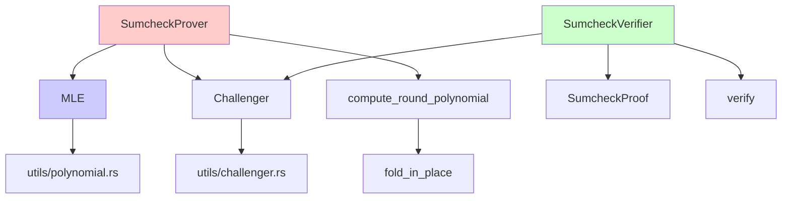
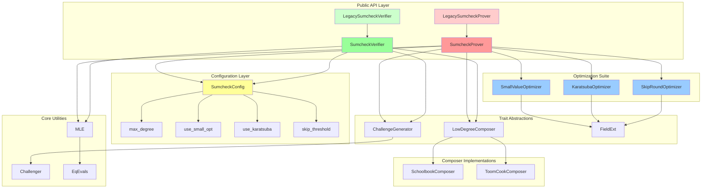
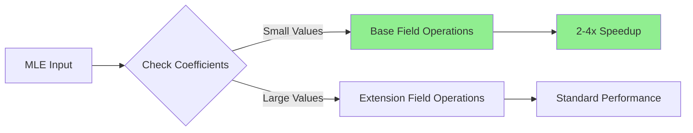
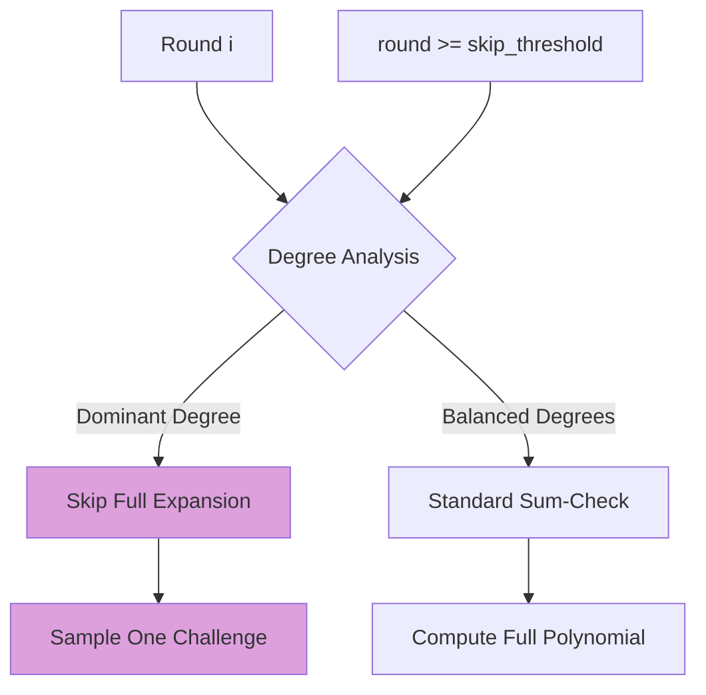
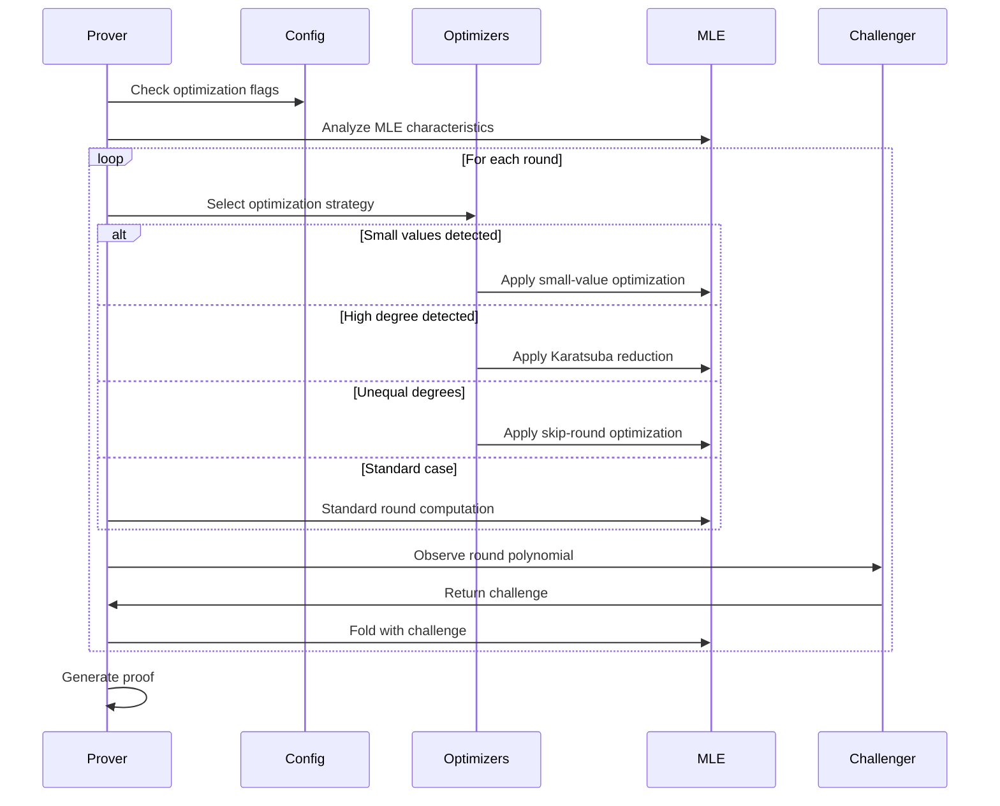
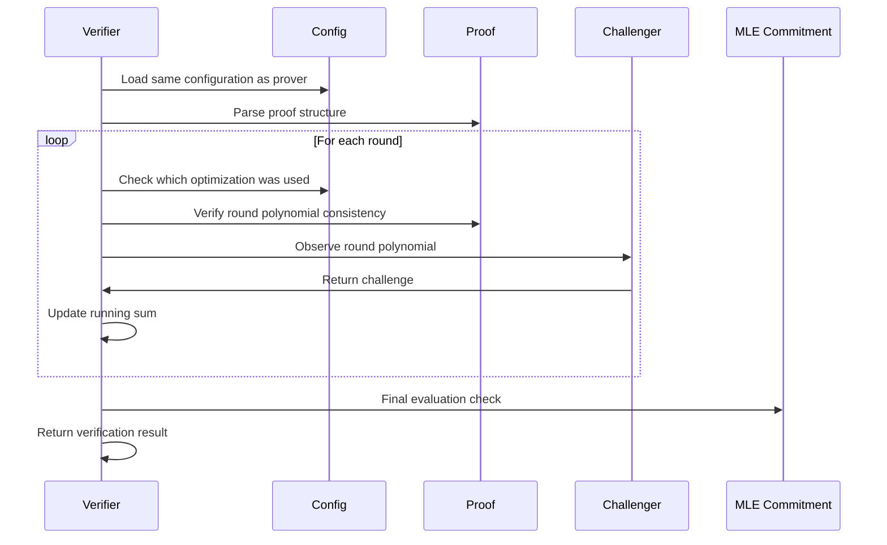
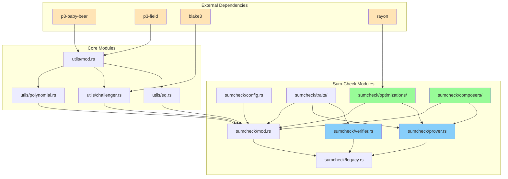
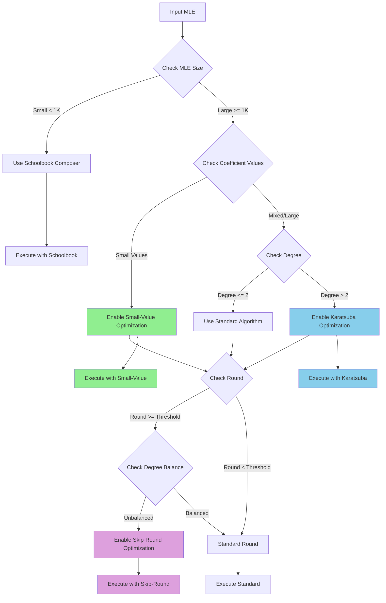

# Sum-Check Module Architecture Diagram

## Current vs. Proposed Architecture

### Current Architecture


### Proposed Hybrid Architecture


## Optimization Integration Flow

### Small-Value Field Splits (ePrint 2025/1117)


### Karatsuba-Style Reduction (ePrint 2024/1046)
```mermaid
graph TD
    A[Degree-d Composition] --> B[Evaluate at d+1 Points]
    B --> C[Multiply Base Products]
    C --> D[Interpolate Univariate Poly]
    D --> E[Reduced from 2^d to d+1 Operations]
    
    F[Memory Usage] --> G[O(d·t) vs O(2^(d·t))]
    
    style E fill:#87CEEB
    style G fill:#87CEEB
```

### Unequal-Degree Skip (ePrint 2024/108)


## Data Flow Architecture

### Prover Flow with Optimizations


### Verifier Flow with Optimization Awareness


## Module Dependencies

### Dependency Graph


## Performance Optimization Decision Tree



## Memory Layout Optimization

### Standard vs. Optimized Memory Usage
```mermaid
graph LR
    subgraph "Standard Implementation"
        A[MLE Coefficients: 2^n]
        B[Round Polynomials: n × degree]
        C[Intermediate Results: 2^d]
        D[Total: O(2^n + n×d + 2^d)]
    end
    
    subgraph "Optimized Implementation"
        E[MLE Coefficients: 2^n]
        F[Round Polynomials: n × degree]
        G[Toom-Cook Cache: d+1]
        H[Small-Value Cache: O(1)]
        I[Total: O(2^n + n×d + d)]
    end
    
    A --> E
    B --> F
    C --> G
    C --> H
    
    style G fill:#87CEEB
    style H fill:#90EE90
    style I fill:#FFD700
```

This architecture diagram illustrates the comprehensive hybrid approach that preserves existing functionality while adding advanced optimizations through a clean, modular design.