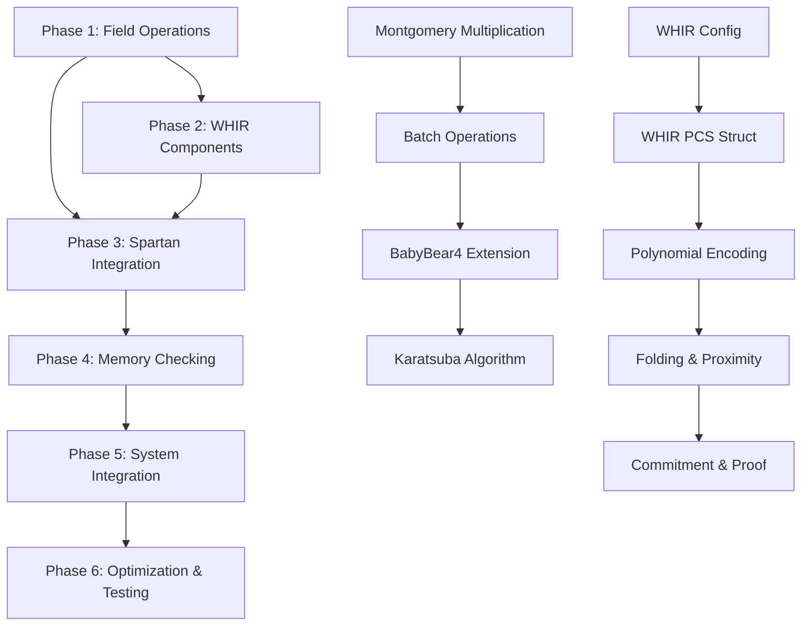

# Spartan-WHIR-Twist&Shout Implementation Plan

## Overview

This plan transforms the comprehensive implementation guide into a phase-by-phase development approach, preserving existing working code while building the complete system. Each task file contains a single function or struct implementation with detailed documentation.

## Phase Structure

```
phases/
├── phase-1-field-operations/
│   ├── 01-montgomery-multiplication.md
│   ├── 02-batch-operations-simd.md
│   ├── 03-babybear4-struct.md
│   ├── 04-karatsuba-multiplication.md
│   └── 05-field-trait-abstractions.md
├── phase-2-whir-components/
│   ├── 01-whir-config.md
│   ├── 02-whir-pcs-struct.md
│   ├── 03-polynomial-encoding.md
│   ├── 04-polynomial-folding.md
│   ├── 05-proximity-testing.md
│   ├── 06-whir-commitment.md
│   ├── 07-whir-proof-generation.md
│   └── 08-whir-verification.md
├── phase-3-spartan-integration/
│   ├── 01-r1cs-struct.md
│   ├── 02-sparse-matrix.md
│   ├── 03-spartan-main-struct.md
│   ├── 04-r1cs-sumcheck-transform.md
│   ├── 05-spartan-preprocessing.md
│   ├── 06-spartan-proof-generation.md
│   └── 07-spartan-verification.md
├── phase-4-memory-checking/
│   ├── 01-onehot-encoding.md
│   ├── 02-sparse-vector.md
│   ├── 03-memory-cell.md
│   ├── 04-twist-protocol.md
│   ├── 05-twist-memory-access.md
│   ├── 06-shout-protocol.md
│   ├── 07-shout-batch-lookup.md
│   └── 08-memory-sumcheck-conversion.md
├── phase-5-system-integration/
│   ├── 01-integrated-prover.md
│   ├── 02-complete-proof-generation.md
│   ├── 03-memory-trace-execution.md
│   ├── 04-witness-extension.md
│   └── 05-system-verification.md
└── phase-6-optimization-testing/
    ├── 01-simd-field-operations.md
    ├── 02-parallel-proof-generation.md
    ├── 03-comprehensive-tests.md
    ├── 04-benchmark-suite.md
    └── 05-example-applications.md
```

## Implementation Strategy

### Existing Code Preservation
- Keep current [`sumcheck/`](src/sumcheck/) module intact
- Preserve [`utils/polynomial.rs`](src/utils/polynomial.rs) MLE implementation
- Maintain [`utils/merkle_tree.rs`](src/utils/merkle_tree.rs) structure
- Build around existing [`utils/challenger.rs`](src/utils/challenger.rs)

### New Module Structure
```
src/
├── field/                    # Enhanced field operations
│   ├── mod.rs
│   ├── babybear.rs          # Montgomery form operations
│   ├── extensions.rs        # BabyBear4 implementation
│   └── optimized/           # SIMD implementations
├── commitments/
│   └── whir/                # WHIR polynomial commitment
│       ├── mod.rs
│       ├── config.rs
│       ├── pcs.rs
│       ├── proximity.rs
│       ├── folding.rs
│       └── verifier.rs
├── spartan/                 # Spartan zkSNARK
│   ├── mod.rs
│   ├── r1cs.rs
│   ├── preprocessing.rs
│   └── integration.rs
├── memory/                  # Twist & Shout
│   ├── mod.rs
│   ├── twist.rs
│   ├── shout.rs
│   └── sparse_commit.rs
└── integrated/              # Complete system
    ├── mod.rs
    ├── prover.rs
    └── verifier.rs
```

## Phase Dependencies



## Key Integration Points

1. **Field Operations**: Enhance existing BabyBear usage with Montgomery form
2. **WHIR Integration**: Build on existing Merkle tree for commitments
3. **Spartan Enhancement**: Extend current sumcheck with R1CS support
4. **Memory Checking**: New sparse polynomial operations
5. **System Integration**: Combine all protocols into unified prover

## Success Criteria

Each phase completion enables:
- **Phase 1**: Optimized field arithmetic foundation
- **Phase 2**: Fast polynomial commitments with WHIR
- **Phase 3**: Complete Spartan zkSNARK system
- **Phase 4**: Memory consistency checking
- **Phase 5**: End-to-end proof generation
- **Phase 6**: Production-ready performance

## Next Steps

1. Create phase directory structure
2. Begin with Phase 1: Enhanced Field Operations
3. Implement each task file with comprehensive documentation
4. Test integration points between phases
5. Optimize and benchmark complete system